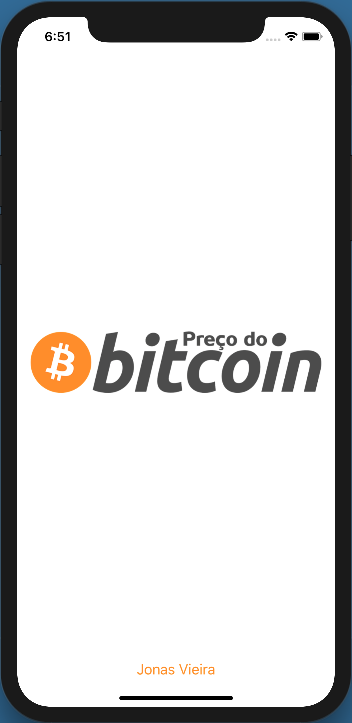
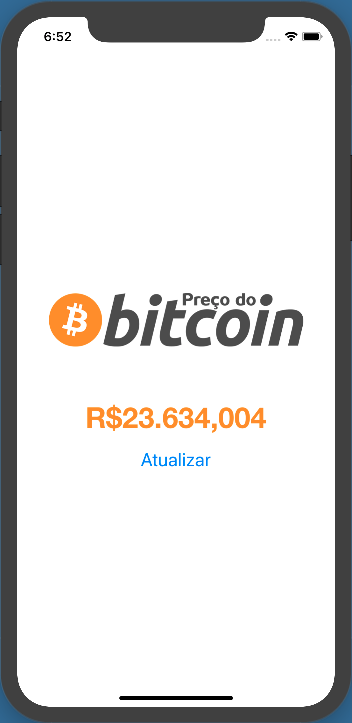

# PrecoBitcoin
Exemplo de como consumir APIs no iOS utilizando Swift. Neste exemplo foi utilizado uma API de consulta do valor do Bitcoin

## Screenshots 

  
  

## Author 

* Jonas Vieira - jonasvieira.ti@gmail.com  
 

